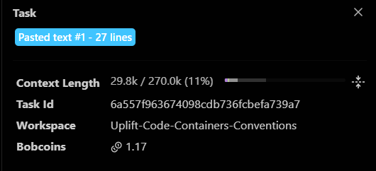
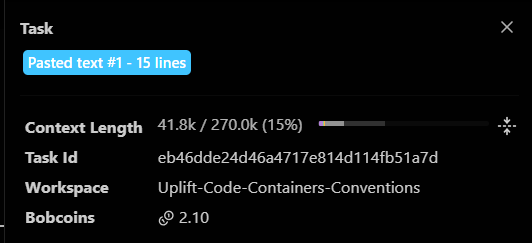
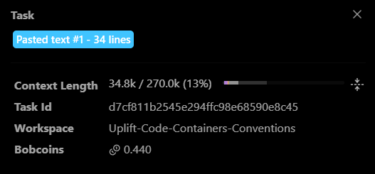
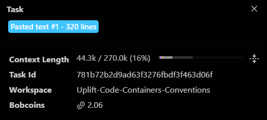

# Bob session log

One row per Bob task. Add the row right after you screenshot the task summary (Bob chat > Tasks > select task > click header). Screenshot name: `uplift_<A|B|C>_task<NN>_<slug>_summary.png`. The first column must be exactly `A`, `B` or `C` (the check script counts rows per member).

Account check (do once): Bob Settings shows `ibm-coding-challenge-uat`, region us-east.

| Member | Task | What Bob did | Files touched | Coins used | Screenshot |
| --- | --- | --- | --- | --- | --- |

| C | C1 | Bob scaffolded the Dash dashboard: report loader with schema validation, change-impact graph builder, app shell, styles and 5 passing tests; verified both mock scenarios render | dashboard/ (app.py, loader.py, graph.py, assets/style.css, tests, reports, requirements.txt, schema copy) | 3.30 | uplift_C_task01_scaffold_summary.png |
| C | C2 | Bob built the landing page (hero, How it works strip, scenario cards with risk badge and headline numbers) and the accessible done/pending stepper, with 12 new tests | dashboard/app.py, dashboard/assets/style.css, dashboard/tests/test_app.py | 1.54 | uplift_C_task02_landing_summary.png |
| C | C3 | Bob added graph filter chips, tap-to-highlight path, legend, Fit button, accessible node list, large-graph label rule, and made node labels readable; 8 new tests | dashboard/graph.py, dashboard/app.py, dashboard/assets/style.css, dashboard/tests | 2.30 | uplift_C_task03_graph_summary.png |
| C | C3b | Bob restyled the filter chips as readable toggle pills with a hint line and tests that the filter options are unchanged | dashboard/app.py, dashboard/assets/style.css, dashboard/tests/test_app.py | 1.45 | uplift_C_task03b_chips_summary.png |
| C | C4 | Bob built the detail panel (snippet, verdict, proof, repair, contracts) and a sortable affected-items table synced with graph selection; 13 new tests | dashboard/panels.py, dashboard/app.py, dashboard/tests/test_panels.py | 3.79 | uplift_C_task04_panel_table_summary.png |
| C | C5 | Bob built the summary strip (risk gauge, metric cards, tests before/after bar, accuracy card with misses modal, tests-to-run and untested lists) and fixed the invisible table header; 12 new tests | dashboard/panels.py, dashboard/app.py, dashboard/requirements.txt, dashboard/tests/test_panels.py | 3.39 | uplift_C_task05_summary_cards_summary.png |
| C | C5b | Bob made the plotly charts readable on the dark theme with a shared light-text layout, transparent backgrounds, faint grid and counts on the bars; 6 new tests | dashboard/panels.py, dashboard/tests/test_panels.py | 1.16 | uplift_C_task05b_charts_summary.png |
| C | C6 | Bob built the Migrate view: guide catalog table with kind filter, four parallel worker lanes with before/after test bars, release notes, summary strip and graph; 12 new tests | dashboard/panels.py, dashboard/app.py, dashboard/tests/test_panels.py | 2.77 | uplift_C_task06_migrate_summary.png |
| C | C6b | Bob fixed the migrate view visuals: worker-lane charts contained in their cards, horizontal bar labels, readable empty states, kind dropdown for the catalog, release-notes heading sizes and graph spacing; 5 new tests | dashboard/panels.py, dashboard/app.py, dashboard/assets/style.css, dashboard/tests/test_panels.py | 3.49 | uplift_C_task06b_lanes_fix_summary.png |
| C | C7 | Bob added drop/paste report validation with schema errors, tabs for the PR comment preview (with copy button) and the Powered by IBM Bob panel; 28 new tests | dashboard/app.py, dashboard/panels.py, dashboard/comment.py, dashboard/tests/test_c7.py | 4.18 | uplift_C_task07_upload_pr_bob_summary.png |
| C | C8a | Bob ran a visual polish pass: CSS design tokens, readable paste box and drop area, dark-theme alerts, padded PR-comment table with verdict pills, larger tables, chart label contrast, styled tabs and hero call-to-action buttons; 41 new tests | dashboard/app.py, dashboard/panels.py, dashboard/assets/style.css, dashboard/tests/test_polish.py | 4.46 | uplift_C_task08a_polish_summary.png |

()

